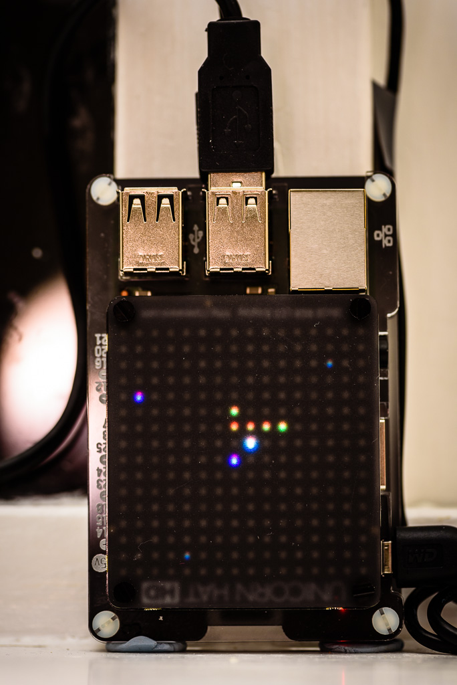

# ADSB PiRadarScope Daemon

This is a companion application for an ADSB receiver running on a Raspberry PI such as PiAware, FR24 or similar 
(using `dump1090-fa` software). 

## Application Description 

This application turns a Raspberry Pi with UnicornHAT HD into a Radar Scope. The receiver's position is marked on the
 scope as a single bright white dot in the centre of the display, with aircraft currently in the range of the ADSB 
 receiver placed around. The positions of the aircraft on the scope against the white receiver pixel correspond to 
 the real GPS positions of the aircraft in relation to the real GPS position of the receiver. 
 
The altitude of the aircraft on the scope is colour coded and the colour scheme is the same as in the case of 
`dump1090-fa` web interface (from lowest to highest these go: red - orange - yellow - green - cyan - blue - purple). 

In addition, it is possible to add a static list of airports to display on the scope as well. These will be marked as
 dark gray dots on the display. 

## Hardware and Software Requirements

To use the application, it has to be running on a Raspberry Pi computer with a UnicornHAT HD (made and sold by 
Pimoroni). In addition, you need to have an access to an ADSB receiver based on `dump1090-fa`. It is possible that 
`dump1090-mutability` will also work, however I had no way of testing this. 

Note: the ADSB receiver software can, but does not have to, run on the same Raspberry Pi as the PiRadarScope. In case
 it is running on a separate computer, all that's required is a network access to the http port on the ADSB receiver 
 computer, and for the web server to be configured to provide the JSON files with aircraft and receiver data. On a 
 default PiAware installation, the following two URLs are used (replace `localhost` with a hostname of your ADSB 
 receiver): 
 
 * http://localhost/dump1090-fa/data/aircraft.json
 * http://localhost/dump1090-fa/data/receiver.json 
 
## Installation
 
The installation steps are as follows:

1. Install `dump1090-fa` based ADSB receiver. Make sure it's receiving aircraft and that you can see them in your web
 browser on the `dump1090-fa` web page. 
2. Install UnicornHAT HD and accompanying software.
3. Clone this repository from github:

    ```bash
    git clone https://github.com/mkrzysztofowicz/piradarscope.git
    cd piradarscope
    ``` 

4. Copy the example configuration file `radarscope.conf` to `/etc` or your home directory (or any other suitable path)
    ```bash
    sudo cp radarscope.conf /etc/radarscope.conf
    ```

5. Copy the daemon file `radarscoped.py` to `/usr/local/bin`
    ```bash
    sudo cp radarscoped.py /usr/local/bin
    sudo chmod 755 /usr/local/bin/radarscoped.py
    sudo ln -s /usr/local/bin/radarscoped.py /usr/local/bin/radarscoped
    ```
    
6. Edit the `/etc/radarscope.conf` file to fit your environment. Refer to the comments in the example file for guidance.

## Usage

1. Start the daemon using the following command:

```bash
sudo radarscoped start -c /etc/radarscope.conf
```

2. Stop the daemon with: 

```bash
sudo radarscoped stop
```

3. Check if the daemon is running
```bash
sudo radarscoped status 
```

NOTE: All the above commands should be issued with `sudo`, however the daemon drops privileges as soon as it starts 
to make sure it doesn't run as the root user. 

To make the daemon start automatically at boot, add the following line at the bottom of `/etc/rc.local`:
```bash
# Start PiRadarScope Daemon
/usr/local/bin/radarscoped start -c /etc/radarscope.conf
```

## How does it look like when it's running

If everything worked well, you should see something similar to below:


